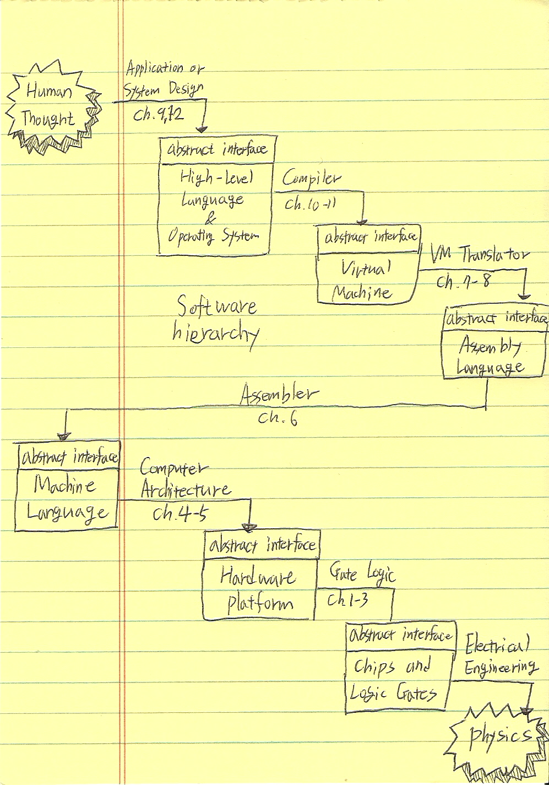

---
layout: post
title: nand2testris
date: 2016-10-18
tags: [nand2tetris, book]
comments: true
feature: /assets/img/scan.png
---      

 이번에 알바하면서 목표는 The Elements of Computing Systems를 완독하는 것이다.  
 예전에 전공 관련해서 질문 글을 보다가 이 책을 누군가 추천하는 것을 보고 난 후 저자의 TED도 보고 블로그 후기들도 볼 수 있었다. 말 그대로 nand에서 tetris를 만드는 과정을 설명해주는 책이라는데, 정말 내가 알고 싶었던 것이었다.  
 컴퓨터가 어떻게 작동하게 되는지가 정말 궁금했는데 전공 시간에 배우긴 했지만 모두 겉핥기 같은 느낌이었다.  
 그래서 요즘 알바를 다시 시작하면서 오전 시간엔 이걸 읽고 있는데 며칠 전, 그러니까 챕터 4를 읽고 나서부터 슬슬 잠이 오고 집중이 전혀 되질 않고 있다. 지나가는 직원분들이 매일 내 책을 보며 깜짝 놀라시며 영문과냐고 다들 물어보시는데 영문과면 해석도 술술 될테니 얼마나 좋을까..ㅋㅋ  
  이건 읽으면 예전에 컴퓨터 구조 수업 때 배웠던 거랑 매치를 시키며 읽게 되니 뭔가 복습도 되고 좋은 느낌이 든다.  
 아무튼 너무 요즘 집중이 안 돼서 필기를 좀 하면서 읽기로 했다.  

 
 신기하게도 책 앞부분에 opentutorials에서 공부했던 내용이 그대로 나왔다. 원래도 좋은 강의였지만 갑자기 신뢰도가 또 상승했다. 강의해주시는 분이 이 책을 읽었을까? 궁금하기도 했다. 아무튼 컴퓨터는 모든 분야에서 일맥상통한다는 것을 느꼈다... 깊이 들어가면 물리까지...  
 하여튼 이제 자지 말고 열심히 읽어봐야겠다!
