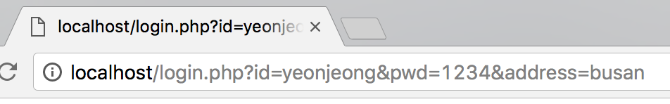
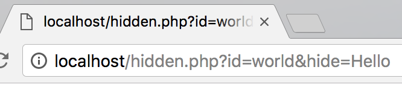

자세한 태그들은 **사용하고 싶을 때** 찾아서 공부하도록 하자.
{: .notice}

# form 태그  


<form action="http://localhost/login.php">
    
아이디 : <input type="text" name="id">

    
비밀번호 : <input type="password" name="pwd">

    
주소: <input type="text" name="address">

    <input type="submit">
</form>

- `input`: 사용자로부터 데이터를 입력할 수 있는 필드를 만든다.  
  - type: 어떤 타입의 필드인지?(text, password...)
  - name: 서로 다른 값들을 구분하기 위해 사용한다.
  - submit: 입력한 데이터를 제출할 수 있는 버튼  
- `form`: 사용자로부터 데이터를 입력받아 서버로 전송
  - action: 입력받은 데이터를 어디로 전송할지 지정  
  - input에 입력받은 내용이 지정한 곳으로 url을 통해 이동된다.  

- submit 버튼을 누른 뒤 주소창 확인  
<figure>
</figure>

## hidden  

<form action="http://localhost/hidden.php">
    <input type="text" name="id">
    <input type="hidden" name="hide" value="Hello">
    <input type="submit">
</form>


<figure>
</figure>
- '어떠한 이유'에 의해 UI없이 서버로 데이터를 전송할 때 사용    
 - 현업에서 자연스럽게 알게되는 필요한 경우가 있다고 한다. 지금은 그냥 알고 넘어가기!  

## method


<form action="http://localhost/method.php" method="post">
    <input type="text" name="id">
    <input type="password" name="pwd">
    <input type="submit">
</form>


- 서버로 데이터를 전송할 때 웹브라우저는 url의 ? 뒤에 데이터를 전송   
 - password 타입으로 보낸 데이터는 url로 전달하면 그대로 노출되어 버림  
  - 감춰서 전달해야 하는 경우도 필요하다 ⇒ post방식

- 전송방식  
 - get
    - 데이터 전송 시 url을 통해 전송하는 방식  
 - post  
    - url이 아닌 데이터를 숨겨 전송한다.(훨씬 안전)  
    - form으로 전송하면 거의 100% 이 방식을 사용하면 된다.   
     - 사실 전송방식의 결정은 서버쪽 엔지니어의 권한이다.  

## 파일 업로드  


<form action="http://localhost/upload.php" method="post" enctype="multipart/form-data">
    <input type="file" name="profile">
    <input type="submit">
</form>


- html은 여기까지 하고, 나중에 서버쪽 공부를 하기.
